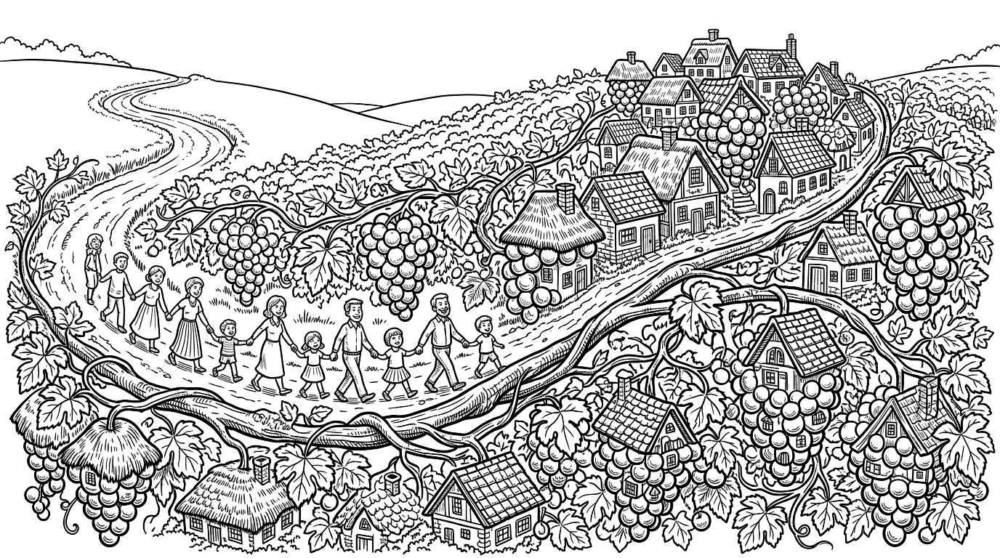
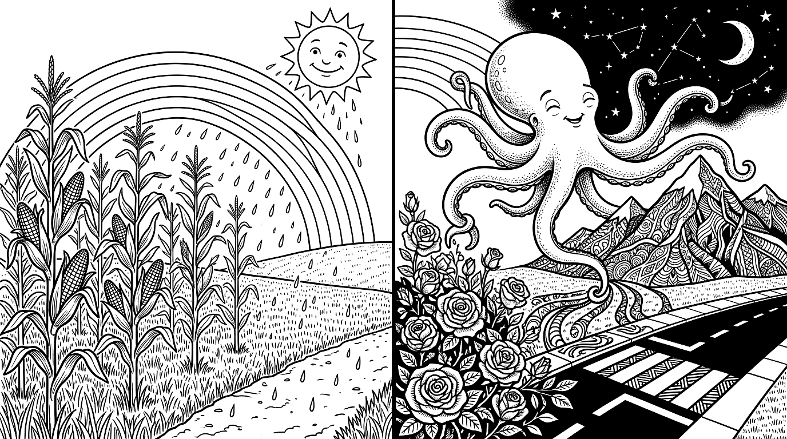
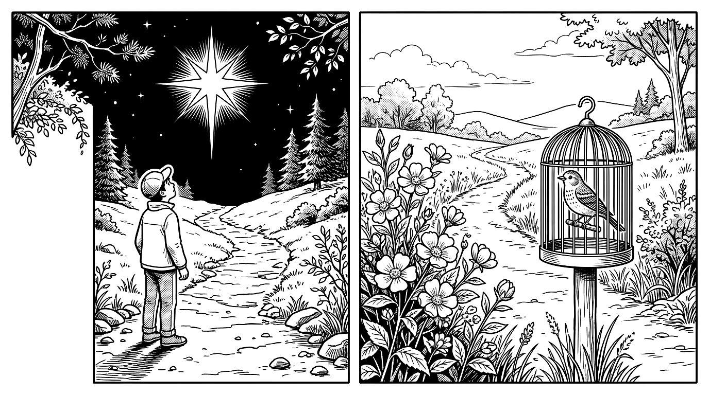
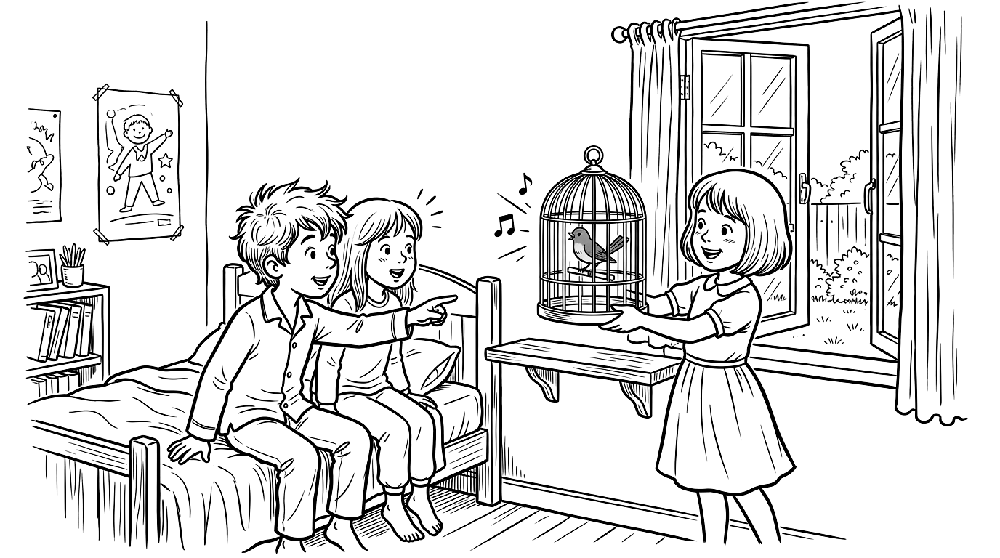
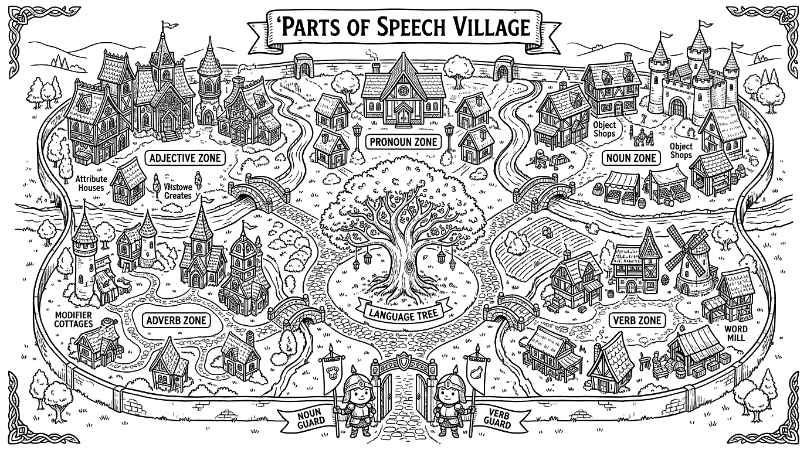
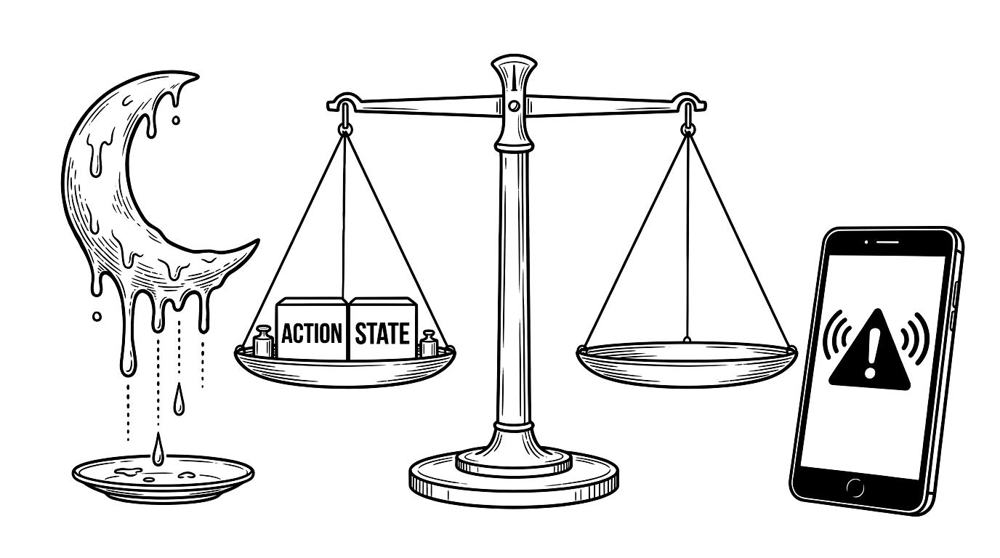

# [교과서 핵심 요약] 1단원(1·2) & 3단원(2) 카테고리별 본문 완독 및 시각화 통합 요약집 [v1]

- **과목 및 학년**: 2026학년도 중학교 1학년 2학기 중간고사 대비 국어
- **교과서 출처**: 2022 개정 교육과정 중학교 국어 1-1 (미래엔 신유식)
- **시험 범위**:
  1. **1. 표현과 소통의 즐거움**: `(1) 길`, `(2) 사랑하는 별 하나` (교과서 12~41쪽)
  2. **3. 능동적인 언어생활**: `(2) 품사의 종류와 특성` (교과서 122~149쪽)
- **문서 분류**: 시험 범위 전 단원 카테고리별 본문 포함 통합 요약 초판 (`요약/1단원_3-2단원_통합_핵심요약_v1.md`)
- **조판 및 구성 특징**:
  1. **6대 핵심 카테고리 명확 분리**: 단원·소단원·학습 단계별로 **6개 독립 카테고리**를 설정하고, 각 카테고리마다 `요약.md`의 5대 핵심 영역(단원 개관 / 핵심 개념 / 본문 전문 및 심층 분석 / 학습 활동 탐구 / 실전 함정 클리닉)을 체계적으로 배치함.
  2. **100% 흑백(Monochrome) 카테고리 일러스트 이미지 및 다이어그램 적극 활용**: 각 카테고리 도입부에 시험지·복사기 환경에 최적화된 **순수 흑백(Monochrome) 펜화 일러스트 이미지 6종**과 구조화 인포그래픽 다이어그램을 결합하여 시각적 각인 효과를 극대화함.
  3. **교과서 제재 및 탐구 지문 본문 원문 100% 수록**: 김종상 〈길〉, 윤동주 〈햇비〉, 안예은 〈문어의 꿈〉, 이성선 〈사랑하는 별 하나〉, 모리스 마테를링크 〈파랑새〉, 양귀자 〈길모퉁이에서 만난 사람〉, 백희나 《달 샤베트》, 세잔 정물화 비평문 등 **시험에 출제되는 모든 본문 원문을 한 글자도 빠짐없이 수록**하고 행·문장 단위로 해부함.

---

## [전체 범위 한눈에 보기] 6대 카테고리 마스터 로드맵

```text
┌────────────────────────────────────────────────────────────────────────────────────────┐
│                    【 2026 중1 국어 중간고사 시험 범위 6대 카테고리 】                 │
├───────────────────────────────────────────┬────────────────────────────────────────────┤
│ ■ PART 1. 문학 — 1. 표현과 소통의 즐거움  │ ■ PART 2. 문법 — 3. 능동적인 언어생활      │
│   (교과서 12~41쪽: 비유 · 운율 · 상징)    │   (교과서 122~149쪽: 품사의 종류와 특성)   │
├───────────────────────────────────────────┼────────────────────────────────────────────┤
│ [카테고리 1] 1-(1) 길 (개념 & 본문 분석)  │ [카테고리 5] 3-(2) 품사 체계 & 마을 탐구   │
│  • 비유(직유·은유·의인) 및 운율의 원리    │  • 단어의 정의(조사 예외) & 3대 분류 기준  │
│  • 김종상 〈길〉 1~5연 본문 전문 & 해부   │  • 5대 기능군·9품사 & 교과서 9개 탐구 본문 │
├───────────────────────────────────────────┼────────────────────────────────────────────┤
│ [카테고리 2] 1-(1) 길 (적용 본문 & 어휘)  │ [카테고리 6] 3-(2) 품사 판별 & 실전 자료   │
│  • 윤동주 〈햇비〉 본문 전문 & 표현 분석  │  • 동사 vs 형용사 1초 판별 저울 순서도     │
│  • 안예은 〈문어의 꿈〉 전문 & 핵심 어휘  │  • 3대 문법 함정 & 《달 샤베트》·재난 문자 │
├───────────────────────────────────────────┴────────────────────────────────────────────┤
│ [카테고리 3] 1-(2) 사랑하는 별 하나 (개념 & 본문 분석)                                 │
│  • 상징(추상적 개념 ➔ 구체적 대상)의 원리 & [함정] 비유 vs 상징 1:1 비교               │
│  • 이성선 〈사랑하는 별 하나〉 1~4연 본문 전문 & 대조적 시어·소망 구조 완벽 해부       │
├────────────────────────────────────────────────────────────────────────────────────────┤
│ [카테고리 4] 1-(2) 사랑하는 별 하나 (적용 본문 〈파랑새〉 & 협동 시·어휘)              │
│  • 모리스 마테를링크 〈파랑새〉 교과서 본문 전문 & '파랑새(행복)' 탐색 과정 4단계      │
│  • 4대 명언(안중근·나폴레옹·헬렌 켈러·테레사) 상징 매핑 & 소단원 필수 어휘 총정리       │
└────────────────────────────────────────────────────────────────────────────────────────┘
```

---

# [카테고리 1] 1-(1) 〈길〉 — 비유와 운율의 개념 및 본문 완독 분석 (교과서 12~21쪽)



## 1. [영역 1] 단원 개관 및 핵심 성취 기준
- **대단원명**: 1. 표현과 소통의 즐거움 (문학 / 매체)
- **소단원명**: (1) 길 (교과서 12~27쪽)
- **핵심 학습 목표 (성취 기준)**: **운율, 비유의 특성과 효과**에 유의하며 작품을 감상하고 창작할 수 있다.

## 2. [영역 2] 소단원 핵심 개념 정리 (비유와 운율)

### 1) 비유(比喩)의 뜻·특성·효과 및 3대 종류 `[빈출]`
- **뜻**: 표현하려는 대상(**원관념**)을 그와 **비슷한 성질(유사성)**을 지닌 다른 대상(**보조 관념**)에 빗대어 표현하는 방법.
- **핵심 특성**: 표현하려는 대상과 빗대어 표현한 대상 사이에는 반드시 **서로 비슷한 점(공통된 성질)**이 존재함.
- **표현 효과**:
  1. 대상을 **참신하고 생생한 느낌**으로 전달함.
  2. **구체적이고 명확한 인상**을 주어 독자가 장면을 머릿속에 쉽게 떠올릴 수 있게 함.

| 비유의 종류 | 핵심 정의 및 판별 공식 | 교과서 대표 예문 |
| :---: | :--- | :--- |
| **직유법**<br>`[빈출]` | **`같이(같은)`, `처럼`, `듯이`, `인 양`** 등 **이어 주는 말(연결어)**을 사용하여 직접 빗대어 표현하는 방법 | • **솜털처럼** 부드러운 잎<br>• 저는 한겨울에 덮는 **담요처럼** 마음이 따뜻한 사람입니다.<br>• **포도송이 같은** 마을 / **포도알 같은** 집들 |
| **은유법**<br>`[빈출]` | 이어 주는 말 없이 **`'A(무엇)는 B(무엇)이다'`** 형식으로 은근하게 빗대어 표현하는 방법 | • 내 **마음은 호수**요.<br>• 저는 **담요**입니다. (라온이의 자기소개)<br>• **길은 포도 덩굴** / **세계는 한 덩이 과일**로 |
| **의인법**<br>`[빈출]` | **사람이 아닌 것(사물·자연물)**을 사람에 빗대어 **마치 사람이 행동하거나 느끼는 것처럼** 표현하는 방법 | • **나무가** 바람결에 **춤을 춘다**.<br>• **해님이 웃는다** 나 보고 웃는다. (〈햇비〉)<br>• **가슴에 화안히 안기어 눈물짓듯 웃어 주는** 하얀 들꽃 |

### 2) 운율(韻律)의 뜻·형성 방법·효과 `[빈출]`
- **뜻**: 시를 읽을 때 느껴지는 **말의 가락(리듬감)**으로, 규칙적인 반복에 의해 형성됨.
- **형성 방법 4가지**:
  1. 같거나 비슷한 **소리(음운)**의 반복 (예: `ㅁ`, `ㅍ`, `ㄷ`, `ㄹ` 울림소리 및 자음 반복)
  2. 같거나 비슷한 **단어·시어**의 반복 (예: `포도 덩굴`, `포도송이`, `포도알`, `덩굴`)
  3. 비슷한 **구절이나 문장 구조(통사 구조)**의 반복 (예: `~ 같은 ~이 있고 / ~ 같은 ~들이 달렸다`, `~과 ~이 ~고`)
  4. 규칙적인 **끊어 읽기(음보·글자 수)** 및 **음성 상징어**(의성어: 소리 흉내 / 의태어: 모양·움직임 흉내, 예: `토실토실`, `보슬보슬`, `알롱알롱`)의 사용
- **표현 효과**:
  1. 시의 **음악성(리듬감)**을 드러내고 독특한 **분위기**를 형성함.
  2. 시의 **주제를 강조**하는 데 도움을 줌.
  3. 시에서 말하는 이(화자)의 **감정을 섬세하고 구체적으로** 드러냄.

---

## 3. [영역 3] 교과서 수록 제재 본문 전문 및 심층 분석 — 김종상, 〈길〉 (14~15쪽)

### 1) 제재 기본 정보
| 갈래 | 성격 | 제재 | 주제 | 특징 |
| :---: | :---: | :---: | :---: | :--- |
| 현대시,<br>자유시, 서정시 | 비유적, 감각적,<br>긍정적, 희망적 | **길**<br>(포도 덩굴) | **길을 통해 서로 돕고 소통하며 하나가 되어 가는 평화로운 세계** | ① '길 ➔ 마을 ➔ 집 ➔ 세계'를 '포도 덩굴 ➔ 포도송이 ➔ 포도알 ➔ 한 덩이 과일'의 **유기적 비유**로 형상화함.<br>② 직유법·은유법과 음성 상징어(`토실토실`), 유사 어휘·문장 구조 반복으로 밝고 경쾌한 운율을 형성함. |

### 2) 〈길〉 본문 원문 전문 및 연별 1:1 정밀 해부 `[빈출]`

> **[제1연]**
> **길은 포도 덩굴** *(은유법: 원관념 '길' = 보조 관념 '포도 덩굴' / 땅 위로 여러 갈래로 뻗어 나가는 모양의 유사성)*
> **몇백 년이나 자라** *(오랜 세월 동안 끊임없이 이어지고 확장되어 온 길의 역사성)*
> **땅덩이를 다 덮었다** *(세상 곳곳으로 뻗어 나가 온 땅을 연결한 길의 모습)*
>
> **[제2연]**
> **이 덩굴 가지마다** *('덩굴 가지' = 큰길에서 갈라져 나온 여러 갈래의 작은 길들)*
> **포도송이 같은 마을이 있고** *(직유법: '같은' 사용 / 원관념 '마을' = 보조 관념 '포도송이' / 집들이 옹기종기 모여 이룬 형태)*
> **포도알 같은 집들이 달렸다** *(직유법: '같은' 사용 / 원관념 '집들' = 보조 관념 '포도알' / 마을을 구성하는 개별 집들의 모습)*
>
> **[제3연]**
> **포도알이 늘 때마다** *(집들이 하나둘 새로 생겨나고 늘어날 때마다)*
> **포도송이는 커 가고** *(집들이 모인 마을의 규모도 점점 커지고 발전해 가며)*
> **갈봄 없이 자라 가는** *('갈봄' = 가을과 봄, 즉 사계절 내내 쉬지 않고 끊임없이 뻗어 나가는)*
> **이 덩굴을 통하여** *(사람과 마을을 이어 주는 소통의 통로인 '길'을 매개로 하여)*
>
> **[제4연]**
> **사람과 사람이 도와 가고** *(길을 통해 사람들이 왕래하며 서로 돕고 정을 나누며 — 대구·문장 구조 반복)*
> **마을과 마을은 이어져서** *(길로 인해 단절되었던 공동체들이 하나로緊밀하게 연결되어)*
>
> **[제5연]**
> **세계는 한 덩이 과일로** *(은유법: 원관념 '세계' = 보조 관념 '한 덩이 과일' / 모든 사람과 마을이 화합하여 하나로 뭉친 공동체)*
> **토실토실 익어 가고 있는 것이다.** *(의태어 '토실토실': 탐스럽고 충실하게 여물어 가는 모양 / '익어 가다': 평화롭고 풍요롭게 성숙·화합해 가는 희망적 미래)*

### 3) [시각화 다이어그램] 〈길〉의 4단계 연쇄 비유 구조도 `[빈출]`
```text
┌───────────────────┐     ┌───────────────────┐     ┌───────────────────────────┐
│ 표현하려는 대상   │     │ 빗대어 표현한 대상│     │ 두 대상의 비슷한 점(유사성)│
│    (원관념)       │     │   (보조 관념)     │     │     및 적용된 수사법      │
├───────────────────┼─────┼───────────────────┼─────┼───────────────────────────┤
│ ① 길              │ ◀═▶ │ 포도 덩굴         │ ◀═▶ │ 여러 갈래(가지)로 땅 위에 │
│   (연결 통로)     │     │ (덩굴 가지)       │     │ 뻗어 나감 【은유법】      │
├───────────────────┼─────┼───────────────────┼─────┼───────────────────────────┤
│ ② 마을            │ ◀═▶ │ 포도송이          │ ◀═▶ │ 작은 단위(집/포도알)들이  │
│   (지역 공동체)   │     │ (포도알의 모임)   │     │ 옹기종기 모여 있음【직유】│
├───────────────────┼─────┼───────────────────┼─────┼───────────────────────────┤
│ ③ 집들            │ ◀═▶ │ 포도알            │ ◀═▶ │ 줄기(길)마다 하나씩       │
│   (개별 보금자리) │     │ (낱개의 열매)     │     │ 달려 모여 있음 【직유법】 │
├───────────────────┼─────┼───────────────────┼─────┼───────────────────────────┤
│ ④ 세계            │ ◀═▶ │ 한 덩이 과일      │ ◀═▶ │ 서로 돕고 이어져 풍요롭게 │
│   (인류 공동체)   │     │ (탐스러운 열매)   │     │ 하나로 뭉쳐 익어감【은유】│
└───────────────────┴─────┴───────────────────┴─────┴───────────────────────────┘
```

---

## 4. [영역 4] 교과서 학습 활동 본문 및 탐구 정리 (12~21쪽)

### 1) [생각과 발견] 라온이의 자기소개 표현 비교 (교과서 12~13쪽 본문)
- **상황**: 중학생이 된 라온이가 국어 수업 첫날, 반 친구들에게 '마음이 따뜻한 자신'을 인상 깊게 소개하려는 장면.
  - **일반 표현**: "저는 마음이 따뜻한 사람입니다." (평범하고 단조로움)
  - **운율(반복) 활용**: "저는 손도 따뜻하고, 발도 따뜻하고, 마음도 따뜻합니다." (`~도 따뜻하고` 반복으로 리듬감 형성)
  - **직유법 활용**: "저는 **한겨울에 덮는 담요처럼** 마음이 따뜻한 사람입니다." (`처럼`을 사용하여 구체적 인상 전달)
  - **은유법 활용**: "**저는 담요입니다.** 저는 마음이 따뜻하기 때문입니다." (`A는 B이다` 형식으로 참신하고 강렬한 인상 전달)

### 2) [이해와 탐구 3·4] 비유·운율 유무에 따른 비교 지문 (교과서 18~21쪽 본문) `[빈출]`
| 비교 지문 〈가〉 (비유·운율이 없는 산문적 표현) | 비교 지문 〈나〉 (비유·운율이 살아 있는 원문 〈길〉) |
| :--- | :--- |
| • **18쪽 〈가〉**: "길마다 / 마을이 있고 / 집들이 있다 / 집들이 늘 때마다 / 마을은 커지고"<br>• **20쪽 〈가〉**: "집들이 늘 때마다 마을은 커진다. 가을봄 할 것 없이 늘어 가는 길을 따라 사람들이 서로 돕고 마을은 서로 이어져서 세계는 하나가 되어 가고 있는 것이다." | • **18·20쪽 〈나〉**: "이 덩굴 가지마다 / 포도송이 같은 마을이 있고 / 포도알 같은 집들이 달렸다 / 포도알이 늘 때마다 / 포도송이는 커 가고 / 갈봄 없이 자라 가는 / 이 덩굴을 통하여 / 사람과 사람이 도와 가고 / 마을과 마을은 이어져서 / 세계는 한 덩이 과일로 / 토실토실 익어 가고 있는 것이다." |
| **비교 결과**: 의미는 같으나 평범하고 설명적이어서 장면이 생생하게 떠오르지 않으며 리듬감이 느껴지지 않음. | **비교 결과**: ① **비유 효과**: 마을·집·세계를 포도송이·포도알·과일에 빗대어 **참신하고 생생하며 구체적인 장면**이 떠오름.<br>② **운율 효과**: 같은 소리(`덩`, `마`, `포도`, `봄`, `토`)와 단어(`포도 덩굴`, `포도송이`, `포도알`), 의태어(`토실토실`) 반복으로 **음악성과 밝은 분위기**가 살아남. |

---

## 5. [영역 5] 실전 시험 대비 핵심 함정 및 출제 포인트 `[함정]`
1. **`[함정]` 〈길〉 제3연 `'포도알'`, `'포도송이'`, `'이 덩굴'`의 원관념 매핑**:
   - 제2연에서는 `'포도송이 같은 마을'`, `'포도알 같은 집들'`처럼 원관념(마을, 집들)이 겉으로 드러난 **직유법**이 쓰였으나, 제3연(`포도알이 늘 때마다 포도송이는 커 가고 ~ 이 덩굴을 통하여`)에서는 원관념을 생략하고 보조 관념만으로 각각 **'집'**, **'마을'**, **'길'**을 가리킴.
2. **`[함정]` `'갈봄 없이'`의 정확한 어휘 뜻**:
   - `'갈봄'`은 **'가을과 봄'**을 아울러 이르는 말로, `'갈봄 없이 자라 가는'`은 **"가을과 봄(사계절) 가릴 것 없이 일 년 내내 끊임없이 뻗어 나가는"**이라는 뜻임 ('갈 곳이 없다'로 오독 주의!).

---

# [카테고리 2] 1-(1) 〈길〉 — 문제 해결과 적용 (〈햇비〉·〈문어의 꿈〉 본문) 및 어휘·점검 (교과서 22~27쪽)



## 1. [영역 3·4] 문제 해결과 적용 ① — 윤동주, 〈햇비〉 본문 전문 및 심층 분석 (22쪽) `[빈출]`

### 1) 작품 개요 및 어휘 풀이
- **작품 성격**: 볕이 나 있는 날 잠깐 오다가 그치는 비(여우비)인 **'햇비'**를 맞으며 건강하고 밝게 자라는 아이들의 모습을 비유와 경쾌한 운율로 그린 동시.
- **교과서 각주 필수 어휘**:
  - **`햇비`**: 볕이 나 있는 날 잠깐 오다가 그치는 비(**여우비**).
  - **`아씨`**: 아랫사람들이 젊은 부녀자를 높여 이르는 말.
  - **`자`**: 길이의 단위 (한 자는 약 `30.3cm`에 해당함 / `닷 자 엿 자` = 다섯 자 여섯 자, 즉 키가 훌쩍 자란 모습).

### 2) 윤동주, 〈햇비〉 본문 원문 전문 및 구절별 표현 분석 `[빈출]`

> **[제1연]**
> **아씨처럼 나린다** *(직유법: 연결어 '처럼' 사용 / 원관념 '햇비' = 보조 관념 '아씨' / 햇비가 조용하고 사뿐사뿐 곱게 내리는 모습을 젊은 아씨의 고운 걸음걸이에 빗댐)*
> **보슬보슬 햇비** *(음성 상징어-의태어 '보슬보슬': 비가 조용히 곱게 내리는 모양 ➔ 운율 및 생동감 형성 / 4·3 글자 수)*
> **맞아 주자 다 같이** *(햇비를 반갑게 맞이하는 아이들의 밝고 친근한 태도 / 도치 표현)*
> **옥수숫대처럼 크게** *(직유법: 연결어 '처럼' 사용 / 원관념 '아이들이 자라는 모습' = 보조 관념 '옥수숫대' / 여름철 쑥쑥 곧고 튼튼하게 자라는 옥수숫대에 빗댐)*
> **닷 자 엿 자 자라게** *(햇비를 맞으며 다섯 자, 여섯 자씩 키가 쑥쑥 자라기를 바라는 소망)*
> **해님이 웃는다** *(의인법: 자연물인 '해'를 사람처럼 높여 부르고('해님') 사람이 '웃는다'고 표현함 ➔ 햇살이 밝고 따뜻하게 비치는 모습)*
> **나 보고 웃는다.** *(의인법 및 '-는다' 어미 반복: 아이들이 햇비를 맞으며 건강하게 자라는 모습을 대견하고 흐뭇하게 바라보는 해님의 따뜻한 시선)*
>
> **[제2연]**
> **하늘 다리 놓였다** *(은유법: 원관념 '무지개' = 보조 관념 '하늘 다리' / 비가 그친 뒤 하늘에 둥글게 걸린 무지개를 하늘을 잇는 다리에 빗댐)*
> **알롱알롱 무지개** *(음성 상징어-의태어 '알롱알롱': 여러 가지 고운 빛깔이 아롱진 모양 ➔ 색채감과 리듬감 부여)*
> **노래하자 즐겁게** *(청유형 '-자' 사용: 무지개가 뜬 맑은 하늘 아래에서 친구들과 함께 노래하며 즐거워함)*
> **동무들아 이리 오나** *(친구들을 정답게 부르며 함께 어울리기를 권유함)*
> **다 같이 춤을 추자** *(모두 함께 어우러져 신나게 춤추는 해맑은 동심)*
> **해님이 웃는다** *(1연과 동일한 시구 반복 ➔ 수미상관식 연 끝 반복으로 통일감과 경쾌한 운율 강화)*
> **즐거워 웃는다.** *(의인법: 아이들이 다 같이 노래하고 춤추는 모습을 보며 해님도 함께 기뻐하며 환하게 빛남)*

### 3) 〈햇비〉에 쓰인 비유와 운율 핵심 요약표 `[빈출]`
| 분석 영역 | 구체적 근거 구절 | 표현 방법 및 효과 |
| :---: | :--- | :--- |
| **비유 표현**<br>**(3종 모두 사용)** | • `아씨처럼 나린다` (햇비 = 아씨)<br>• `옥수숫대처럼 크게` (아이들 = 옥수숫대) | **직유법 (`처럼`)**: 햇비가 곱게 내리는 모습과 아이들이 쑥쑥 자라는 모습을 생생하게 떠올리게 함. |
| | • `하늘 다리 놓였다` / `알롱알롱 무지개` (무지개 = 하늘 다리) | **은유법**: 하늘에 걸린 반원형 무지개를 '하늘 다리'에 참신하게 빗댐. |
| | • `해님이 웃는다 / 나 보고 웃는다` (1연)<br>• `해님이 웃는다 / 즐거워 웃는다` (2연) | **의인법**: 햇살이 밝게 비치는 모습을 해님이 아이들을 보며 흐뭇하게 웃는 것으로 표현하여 따뜻하고 밝은 분위기를 형성함. |
| **운율 형성**<br>**(4대 요소)** | • **글자 수(음수율) 반복**: 각 행이 주로 **`4·3조`** (`아씨처럼(4) 나린다(3)`, `보슬보슬(4) 햇비(2/3)`, `맞아 주자(4) 다 같이(3)` 등)로 규칙적임.<br>• **음성 상징어(의태어)**: `보슬보슬`, `알롱알롱`<br>• **단어·시구·어미 반복**: `해님이 웃는다`, `~ 웃는다`, `~자`(청유형), `다 같이`<br>• **1연과 2연의 대칭적 구조**: 각 연이 정확히 7행으로 구성되며 마지막 2행(`해님이 웃는다 / ~ 웃는다`)이 대응함. | 시의 음악성(명랑하고 경쾌한 리듬감)을 살리고, **밝고 건강하게 자라는 아이들의 모습(주제)**을 효과적으로 강조함. |

---

## 2. [영역 3·4] 문제 해결과 적용 ② — 안예은, 〈문어의 꿈〉 노랫말 본문 분석 (23쪽)

### 1) 〈문어의 꿈〉 본문 원문 전문
> **나는 문어 꿈을 꾸는 문어** *(은유법: '나는 문어(이다)' + '문어' 단어 반복)*
> **꿈속에서는 무엇이든지 될 수 있어.** *(무한한 상상력과 변신의 공간인 '꿈')*
> **나는 문어 잠을 자는 문어** *(1행과 유사한 문장 구조 반복: '나는 문어 ~는 문어')*
> **잠이 드는 순간 여행이 시작되는 거야.** *(은유법: '꿈을 꾸는 것'을 '여행'에 빗대어 표현함)*
> **높은 산에 올라가면 나는 초록색 문어** *('~에 ~면 나는 ~ 문어' 문장 구조 반복 ①)*
> **장미꽃밭 숨어들면 나는 빨간색 문어** *('~에 ~면 나는 ~ 문어' 문장 구조 반복 ②)*
> **횡단보도 건너가면 나는 줄무늬 문어** *('~에 ~면 나는 ~ 문어' 문장 구조 반복 ③)*
> **밤하늘을 날아가면 나는**
> **오색찬란한 문어가 되는 거** *('~에 ~면 나는 ~ 문어' 문장 구조 반복 ④ — 주변 환경에 따라 몸 색깔을 자유자재로 바꾸는 문어의 생태적 특징을 꿈속의 자유로운 변신에 빗댐)*
> — 안예은 작사, 〈문어의 꿈〉에서

### 2) 핵심 정리
- **비유가 쓰인 구절**: `'나는 문어'`, `'잠이 드는 순간 여행이 시작되는 거야'` (자신을 자유롭게 변신하는 문어에, 꿈꾸는 것을 여행에 **은유**함).
- **운율이 느껴지는 구절**: `'나는 문어 ~는 문어'`, `'~에 올라가면/숨어들면/건너가면/날아가면 나는 ~ 문어'`와 같이 **같은 단어(`나는`, `문어`)와 비슷한 문장 구조(`~면 나는 ~ 문어`)를 반복**하여 경쾌한 노랫말의 리듬감을 형성함.

---

## 3. [영역 4·5] 소단원 (1) 정리와 점검 및 필수 어휘 클리닉 (26~27쪽)

### 1) [정리와 점검 2] 속담의 비유와 운율 분석 (26쪽)
- **대상 자료 〈가〉**: **`"콩 심은 데 콩 나고 팥 심은 데 팥 난다"`**
  - **비유 표현**: 농작물(콩, 팥)을 심은 대로 거둔다는 자연 현상에 빗대어, **"모든 일은 근본이나 원인에 따라 그에 걸맞은 결과가 나타난다"**는 교훈적 의미를 비유함.
  - **운율 요소**: `'콩'`, `'팥'`, `'심은 데'`, `'난다'` 등 **같은 단어와 `'~ 심은 데 ~ 난다'`라는 동일한 문장 구조를 대칭적으로 반복(대구)**하여 리듬감을 주고 기억하기 쉽게 함.

### 2) [어휘로 마무리] 스마트폰 비밀번호 어휘 정오 판별 (27쪽) `[함정]`
- **올바르게 쓰인 문장 (정답 번호: `2 - 3 - 4 - 5 - 8`)**:
  - `2번` **(O)**: "**갈봄** 여름 없이 꽃이 핀다." (`갈봄`: 가을과 봄)
  - `3번` **(O)**: "담벼락을 타고 **덩굴**이 자란다." (`덩굴`: 길게 뻗어 나가는 식물의 줄기)
  - `4번` **(O)**: "사람마다 운동 **효과**가 다를 수 있다." (`효과`: 어떤 목적을 지닌 행위에 의해 드러나는 좋은 결과)
  - `5번` **(O)**: "빨간 내 얼굴을 사과에 **빗대었다**." (`빗대다`: 어떤 대상을 다른 대상에 비유하여 표현하다)
  - `8번` **(O)**: "이곳은 **땅덩이**가 좁지만 구경할 곳이 많다." (`땅덩이`: 땅의 덩어리, 땅의 넓이)
- **잘못 쓰인 문장 및 수정 (`[함정]` 어휘 오용 선지 출제 1순위)**:
  - `0번` **(X)**: "일기를 쓰며 **반복**(➔ **반성/성찰**)의 시간을 갖는다."
  - `1번` **(X)**: "벼가 누렇게 **익숙하다**(➔ **익었다/여물었다**)."
  - `6번` **(X)**: "갈대가 바람에 **토실토실**(➔ **한들한들/살랑살랑**) 흔들린다." (`토실토실`은 살이 통통하게 찐 모양이나 열매가 탐스럽게 여문 모양을 뜻함)
  - `7번` **(X)**: "이 시계는 방수가 된다는 **특수**(➔ **특성/특징**)가 있다."
  - `9번` **(X)**: "다른 사람들이 생각하지 못한 것이라 **참견하다**(➔ **참신하다**)."

---

# [카테고리 3] 1-(2) 〈사랑하는 별 하나〉 — 상징의 개념·특성·효과 및 본문 완독 분석 (교과서 28~35쪽)



## 1. [영역 1] 단원 개관 및 핵심 성취 기준
- **소단원명**: (2) 사랑하는 별 하나 (교과서 28~41쪽)
- **핵심 학습 목표 (성취 기준)**: **상징의 특성과 효과**에 유의하며 작품을 감상하고 창작할 수 있다.

## 2. [영역 2] 소단원 핵심 개념 정리 (상징 vs 비유 완벽 비교)

### 1) 구체적 대상 vs 추상적 개념 (32쪽)
- **구체적(具體的) 대상**: 일정한 형태와 성질을 갖추고 있어서 **눈으로 직접 보거나 손으로 만질 수 있는 것** (예: `별`, `꽃`, `대추`, `파랑새`, `가방`, `나무`).
- **추상적(抽象的) 개념**: 인간의 내적 경험이나 감정, 사상처럼 일정한 형태와 성질을 갖추고 있지 않아서 **직접 보거나 만질 수 없는 것** (예: `사랑`, `위로`, `희망`, `행복`, `기쁨`, `편안함`, `우정`, `평화`).

### 2) 상징(象徵)의 뜻·특성·효과 (34쪽) `[빈출]`
- **뜻**: 인간의 내적 경험이나 감정, 사상과 같은 **추상적 개념(원관념)**을 **구체적 대상(보조 관념)**으로 나타내는 표현 방법.
- **핵심 특성 (`[빈출]` 시험 단골)**:
  - 표현하려는 **추상적 개념(원관념)이 작품 겉으로 드러나지 않고**, 이를 표현하기 위한 **구체적 대상(보조 관념)만 전면에 드러남**.
  - 따라서 독자의 경험이나 맥락에 따라 구체적 대상의 의미를 **다양하게(다의적으로) 해석**할 수 있음.
- **표현 효과 4가지**:
  1. **독자 측면 ①**: 머릿속에서 눈에 보이지 않는 추상적 개념을 **구체적으로 그릴 수 있음**.
  2. **독자 측면 ②**: 겉으로 드러나지 않은 숨은 의미를 다양하게 생각해 봄으로써 **작품을 깊이 있게 감상**할 수 있음.
  3. **작가 측면 ①**: 작품의 **주제를 더욱 효과적이고 인상 깊게** 드러낼 수 있음.
  4. **작가 측면 ②**: 구체적 대상이 지닌 본래의 의미에 **새로운 의미를 부여**할 수 있어서 작품의 의미가 더욱 다양하고 풍부해짐.

### 3) [함정 클리닉] 비유(소단원 1) vs 상징(소단원 2) 1:1 완벽 비교표 `[함정]`

| 비교 기준 | 비유 (比喩) — 〈길〉, 〈햇비〉 | 상징 (象徵) — 〈사랑하는 별 하나〉, 〈파랑새〉 |
| :---: | :--- | :--- |
| **원관념(표현하려는 대상)의 노출 여부** | 원관념(A)과 보조 관념(B)이 **함께 겉으로 드러나는 경우가 일반적임**<br>• `길(A)은 포도 덩굴(B)`<br>• `포도송이(B) 같은 마을(A)` | 원관념(추상적 개념 A)은 **겉으로 숨겨져 드러나지 않고**, 오직 **구체적 대상(보조 관념 B)만** 나타남<br>• `가슴에 사랑하는 별(B) 하나를 갖고 싶다.`<br>• `파랑새(B)는 우리 가까이에 있으니까.` |
| **결합 관계 및 해석** | 두 대상 사이의 **1:1 유사성(비슷한 점)**에 기초함 | 구체적 대상 하나가 여러 추상적 의미(위로, 희망, 사랑, 길잡이 등)를 내포하여 **1:다(多)의 다양한 해석**이 가능함 |

---

## 3. [영역 3] 교과서 수록 제재 본문 전문 및 심층 분석 — 이성선, 〈사랑하는 별 하나〉 (30~31쪽)

### 1) 제재 기본 정보
| 갈래 | 성격 | 제재 | 주제 | 특징 |
| :---: | :---: | :---: | :---: | :--- |
| 현대시,<br>자유시, 서정시 | 상징적, 서정적,<br>성찰적, 소망적 | **별, 꽃**<br>(하얀 들꽃) | **외롭고 괴로운 삶 속에서 서로에게 위로와 희망(빛)이 되어 주는 존재에 대한 소망** | ① `'별'`과 `'꽃(하얀 들꽃)'`의 상징적 시어를 통해 화자의 소망을 형상화함.<br>② 어둡고 부정적인 상황(`외로워`, `괴로워`, `어두운 밤`)과 밝고 순수한 이미지(`별`, `하얀 들꽃`, `맑은 눈빛`)의 **선명한 대조**.<br>③ **1~2연(`~될 수 있을까`)**과 **3~4연(`~갖고 싶다`)**의 대칭적 반복 구조로 운율과 주제를 강화함. |

### 2) 〈사랑하는 별 하나〉 본문 원문 전문 및 연별 정밀 해부 `[빈출]`

> **[제1연] — 타인에게 위로와 빛을 주는 '별과 같은 사람'이 되고 싶은 소망**
> **나도 별과 같은 사람이** *(직유법: '같은' 사용 / 누군가에게 위로와 희망을 주는 존재)*
> **될 수 있을까.** *(화자의 겸손한 성찰과 간절한 소망을 담은 의문형 어미 반복 ①)*
> **외로워 쳐다보면** *(타인이 처한 부정적·고독한 상황 ①)*
> **눈 마주쳐 마음 비춰 주는** *(외로운 사람의 아픔에 공감하고 따뜻한 위로와 빛을 건네는 행동)*
> **그런 사람이 될 수 있을까.** *(타인의 마음을 환하게 밝혀 주는 존재가 되고 싶은 소망)*
>
> **[제2연] — 세상일에 지친 이에게 기쁨과 위안을 주는 '꽃(하얀 들꽃)'이 되고 싶은 소망**
> **나도 꽃이 될 수 있을까.** *(상징 및 은유적 표현: 위로와 평안을 주는 존재)*
> **세상일이 괴로워 쓸쓸히 밖으로 나서는 날에** *(타인이 처한 힘들고 고달픈 상황 ②)*
> **가슴에 화안히 안기어** *(`화안히`: '환히'의 **시적 허용** — 글자 수를 늘려 운율감을 살리고 빛이 맑고 밝게 퍼지는 느낌을 강조함)*
> **눈물짓듯 웃어 주는** *(직유법 + 의인법 + 역설적 공감 표현: 상대방의 슬픔에 깊이 공감하여 눈물을 글썽이면서도 따뜻하게 미소 지어 위로해 주는 들꽃의 모습)*
> **하얀 들꽃이 될 수 있을까.** *(소박하고 순수하게 타인의 상처를 감싸 안는 존재가 되고 싶은 소망)*
>
> **[제3연] — 내가 외로울 때 나를 위로해 줄 '사랑하는 별 하나'를 갖고 싶은 소망**
> **가슴에 사랑하는 별 하나를 갖고 싶다.** *(상징: 원관념 없이 구체적 대상 '별'만 제시 ➔ 마음속 깊이 의지하고 위로받을 수 있는 소중한 존재/사람을 만나고 싶은 소망)*
> **외로울 때 부르면 다가오는** *(화자 자신이 외로움에 처했을 때 언제든 곁에 와서 함께해 주는)*
> **별 하나를 갖고 싶다.** *(`~ 별 하나를 갖고 싶다` 반복을 통한 소망의 강조와 운율 형성)*
>
> **[제4연] — 고난 속에서 나를 정화하고 삶의 길을 인도해 줄 '그런 사람'을 갖고 싶은 소망**
> **마음 어두운 밤 깊을수록** *(`마음 어두운 밤`: 절망, 시련, 고통, 방황이 깊어지는 극한의 부정적 상황)*
> **우러러 쳐다보면** *(`우러르다`: 위를 향하여 고개를 정중히 쳐들다 ➔ 존경과 갈망의 태도)*
> **반짝이는 그 맑은 눈빛으로 나를 씻어** *(순수하고 맑은 정신/사랑으로 내 마음의 어둠과 슬픔, 고통을 깨끗이 정화(淨化)해 주고)*
> **길을 비추어 주는** *(방황하는 나에게 앞으로 나아갈 올바른 삶의 방향과 희망을 인도해 주는)*
> **그런 사람 하나 갖고 싶다.** *(나를 구원하고 이끌어 줄 참된 동반자·길잡이를 간절히 소망함)*

### 3) [시각화 다이어그램] 〈사랑하는 별 하나〉의 대칭 구조 및 시어 대조표 `[빈출]`
```text
┌───────────────────────────────────────┬───────────────────────────────────────┐
│     【 제1연 ~ 제2연의 화자 태도 】    │     【 제3연 ~ 제4연의 화자 태도 】    │
│    "~ 될 수 있을까." (성찰적 의문형)   │      "~ 갖고 싶다." (의지적 평서형)    │
├───────────────────────────────────────┼───────────────────────────────────────┤
│ • 방향: 【 나 ➔ 타인 (주는 사랑) 】    │ • 방향: 【 타인(별) ➔ 나 (받는 구원) 】│
│ • 소망: 외롭고 괴로운 누군가에게      │ • 소망: 내 마음이 어둡고 외로울 때    │
│   마음을 비춰 주고 웃어 주는          │   나를 깨끗이 씻어 주고 삶의 길을     │
│   '별과 같은 사람', '하얀 들꽃'이     │   비추어 주는 '사랑하는 별 하나(사람)'│
│   되고 싶음.                          │   를 가슴에 품고 만나고 싶음.         │
└───────────────────────────────────────┴───────────────────────────────────────┘
```

| 구분 | 화자(또는 인간)가 처한 상황 (부정적·어두운 이미지) | 화자가 소망하는 상징적 존재 (긍정적·밝은 이미지) |
| :---: | :--- | :--- |
| **대조적 시어** | • `외로워`, `세상일이 괴로워 쓸쓸히`<br>• `외로울 때`, `마음 어두운 밤 깊을수록` | • **`별`**, **`꽃` (`하얀 들꽃`)**, **`그런 사람`**<br>• `마음 비춰 주는`, `화안히`, `맑은 눈빛`, `길을 비추어 주는` |
| **상징적 의미** | 인간이 삶에서 겪는 **고독, 시련, 절망, 슬픔, 방황** | 고통받는 이를 감싸 주는 **위로, 사랑, 공감, 희망, 정화, 삶의 길잡이(인도자)** |

---

## 4. [영역 4] 교과서 학습 활동 본문 및 탐구 정리 (28~35쪽)

### 1) [생각과 발견] 황순원 《소나기》 속 '대추'의 의미가 다양하게 해석되는 까닭 (28~29쪽)
- **본문 대화 상황**: 소설 《소나기》에서 여자아이가 남자아이에게 대추를 건네주는 장면을 읽은 다감이가 친하게 지내고 싶은 친구 현주에게 대추를 건넴.
  - **다감이가 생각한 '대추'의 의미**: 친구와 **친하게 지내고 싶은 마음(호감, 우정)**.
  - **현주가 생각한 '대추'의 의미**: 대추는 건강에 좋으므로 **건강하라는 뜻**.
  - **핵심 원리 (`[빈출]`)**: '대추'라는 **구체적 대상**만 제시하고 전달하려는 **추상적 마음(원관념)을 직접 말하지 않았기 때문에**, 받아들이는 사람의 배경지식이나 상황에 따라 **대상의 의미가 다양하게 해석**될 수 있음.

### 2) [이해와 탐구 3] 상징을 쓰지 않은 글 〈가〉 vs 상징을 쓴 원문 〈나〉 비교 (35쪽)
- **〈가〉 (추상적 개념 직접 노출)**: `"마음을 위로해 주는 사람을 만나고 싶다. / 외로움을 달래 주는 사람을 만나고 싶다."`
- **〈나〉 (상징 활용 원문 3연)**: `"가슴에 사랑하는 별 하나를 갖고 싶다. / 외로울 때 부르면 다가오는 / 별 하나를 갖고 싶다."`
- **비교 결과**: 〈가〉는 의미가 분명하지만 단조롭고 여운이 짧은 반면, 〈나〉는 추상적 개념('마음을 위로해 주고 외로움을 달래 주는 사람')을 직접 드러내지 않고 **`'별'`이라는 구체적 대상으로 상징**하여 독자가 머릿속에 아름다운 장면을 구체적으로 그리고 의미를 깊이 있게 곱씹게 만듦.

---

## 5. [영역 5] 실전 시험 대비 핵심 함정 및 출제 포인트 `[함정]`
1. **`[함정]` 1연의 `'별과 같은 사람'` vs 3연의 `'사랑하는 별 하나'` 표현 기법 구별**:
   - **1연 `"나도 별과 같은 사람이 될 수 있을까"`**: `'같은'`이라는 연결어를 사용하여 `'사람'(원관념)`을 `'별'(보조 관념)`에 직접 빗대었으므로 **직유법(비유)**이 쓰임!
   - **3연 `"가슴에 사랑하는 별 하나를 갖고 싶다"`**: 원관념(위로와 희망을 주는 소중한 사람)을 숨기고 구체적 대상인 **`'별'`만 단독으로 제시**하였으므로 전형적인 **상징**이 쓰임!
2. **`[함정]` 시적 허용 `'화안히'`의 원리**:
   - 표준어 표기는 **`'환히'`**(2음절)이나, 시인이 의도적으로 **`'화안히'`**(3음절)로 늘려 써서 **운율(리듬감)을 살리고 가슴속이 맑고 환하게 밝아지는 정서적 여운을 극대화**한 **시적 허용**임.

---

# [카테고리 4] 1-(2) 〈사랑하는 별 하나〉 — 문제 해결과 적용 (〈파랑새〉·협동 시 본문) 및 어휘·점검 (교과서 36~41쪽)



## 1. [영역 3·4] 문제 해결과 적용 ① — 모리스 마테를링크, 〈파랑새〉 본문 전문 및 분석 (36~37쪽) `[빈출]`

### 1) 앞부분의 줄거리 및 본문 원문 전문 수록
> **[앞부분의 줄거리 (36쪽)]**
> 크리스마스 전날 밤, 풍요로운 이웃을 보며 부러워하는 **틸틸과 미틸** 남매 앞에 요술쟁이 할머니가 나타나 자신의 아픈 딸을 위해 **파랑새**를 찾아달라고 부탁한다. 남매는 할머니가 준 요술 모자를 쓰고 꿈속으로 요정과 함께 파랑새를 찾아 떠난다. 그들은 **추억의 나라, 밤의 궁전, 숲**을 차례로 들르지만 파랑새를 찾지 못한다.
>
> **[본문 원문 전문 (36~37쪽)]**
> 틸틸과 미틸은 **행복의 나라**에 도착했어요.
> 한 무리의 아이들이 빙글빙글 돌며 춤을 추었어요.
> **“안녕! 우리들은 너희 집에 사는 행복들이야. 나는 건강의 행복!”**
> 아이들 가운데 하나가 입을 열자, 모두가 **조잘대기** 시작했어요.
> **“나는 맑은 공기의 행복!”**
> **“나는 부모님을 사랑하는 행복!”**
> **“나는 봄의 행복!”**
> 아이들의 말을 듣고, 틸틸이 깜짝 놀라 물었어요.
> **“우리 집에 행복이 그렇게 많단 말이야?”**
> **“그럼! 우리들은 늘 사람들 곁에 있어. 사람들이 그걸 모를 뿐이지.”** *(주제 의식이 직접 드러나는 핵심 대사 ①)*
> 그때, 엄마를 닮은 아름다운 부인이 틸틸과 미틸을 부르며 달려왔어요.
> “난 **‘엄마의 행복’**이란다. 모든 행복 중에서 가장 큰 행복이지. 그래서 난 늙지 않고 항상 고운 모습을 하고 있는 거란다.”
> 틸틸과 미틸은 ‘엄마의 행복’에게 안겨 물었어요.
> “여기에 파랑새가 있나요?”
> **“여기는 행복이 넘쳐 나는 곳이라서 파랑새가 필요 없단다.”** *(파랑새 = 행복임을 암시하는 단서)* (중략)
>
> 틸틸은 엄마가 깨우는 소리에 벌떡 일어났어요. 어찌 된 일인지 빛의 요정도, 모자도 보이지 않았어요.
> 바로 그때, 방문을 열고 한 할머니가 들어왔어요. 파랑새를 부탁한 요술쟁이 할머니와 너무나 닮았지요.
> “나는 이웃집에 사는데, 새를 빌리러 왔단다. **앓아누운** 내 딸이 새를 갖고 싶어 하거든.”
> 틸틸은 새장을 바라보고 깜짝 놀랐어요.
> **“아, 파랑새다! 그렇게 찾았는데. 파랑새가 우리 집에 있었어!”** *(핵심 대사 ②: 행복은 먼 곳이 아니라 바로 우리 집, 일상 속에 있었음을 깨달음)*
> 틸틸은 파랑새를 할머니에게 주었어요. *(이웃에게 행복을 나누어 주는 이타적 행동)*
> 다음날, 이웃집 할머니를 따라 여자아이가 찾아왔어요.
> **“고마워. 파랑새를 보고 아픈 게 다 나았어.”** *(나눔을 통해 이웃 소녀가 행복과 건강을 되찾음)*
> 빛의 요정을 꼭 닮은 여자아이가 파랑새를 안고 말했어요.
> 미틸은 파랑새를 쓰다듬어 주려고 다가갔어요.
> 그 순간, 파랑새는 그만 **포르르** 날아가 버렸지요. *(행복은 한곳에 영원히 가두어 소유할 수 있는 물질이 아님을 상징)*
> 여자아이가 울음을 터뜨리자, 틸틸이 달래 주었어요.
> **“괜찮아. 내가 또 파랑새를 찾아 줄게. 파랑새는 우리 가까이에 있으니까.”** *(핵심 대사 ③: 행복의 참된 의미를 깨달은 틸틸의 내면적 성장)*
> — 모리스 마테를링크, 〈파랑새〉에서

### 2) 〈파랑새〉 탐색 과정 4단계 및 상징 분석 `[빈출]`
```text
[1단계: 꿈속의 먼 여행] 추억의 나라, 밤의 궁전, 숲을 헤매며 파랑새를 찾지만 찾지 못함.
          ▼
[2단계: 행복의 나라 도착] '건강/맑은 공기/부모님 사랑/봄/엄마의 행복'을 만나며 행복이 늘 우리 집에 있었음을 알게 됨 ("여기는 행복이 넘쳐 나는 곳이라서 파랑새가 필요 없단다.")
          ▼
[3단계: 잠에서 깬 현실(우리 집)] 자신이 기르던 새장 속의 새가 바로 그토록 찾던 '파랑새'였음을 발견함 ➔ 이웃집 아픈 딸을 위해 파랑새를 기꺼이 선물함(아픈 병이 다 나음).
          ▼
[4단계: 파랑새가 날아간 뒤의 깨달음] 파랑새가 포르르 날아가 버리지만 슬퍼하지 않음 ➔ "파랑새(행복)는 우리 가까이에 있으니까" 언제든 다시 찾을 수 있다고 확신함.
```
- **구체적 대상 `'파랑새'`가 상징하는 추상적 개념**: **'행복' (진정한 행복)**
- **작가가 상징을 통해 전달하고자 한 주제**: 진정한 행복(`파랑새`)은 멀리 있는 특별한 것이 아니라 **건강, 맑은 공기, 가족의 사랑, 이웃과의 나눔처럼 늘 우리 주변과 평범한 일상 가까이에 존재한다**는 깨달음.

---

## 2. [영역 4·5] 문제 해결과 적용 ② — 협동 시 명언 4종 및 어휘 마무리 (38~41쪽)

### 1) 명언의 추상적 의미를 구체적 대상(상징)으로 바꾸기 (38쪽)
| 인물 및 명언 원문 | 명언에 담긴 추상적 의미 | 상징할 수 있는 구체적 대상 예시 |
| :--- | :--- | :--- |
| **안중근**: `"정의는 절대 죽지 않으며 결코 묻히지 않는다."` | 시련 속에서도 굴하지 않는 **정의와 진실의 생명력** | 눈보라 속에서도 푸른 **소나무**, 바위를 뚫고 솟아나는 **새싹/샘물** |
| **나폴레옹**: `"내 사전에는 불가능이란 말은 없다."` | 어떤 어려움도 극복하는 **도전 정신과 굳은 의지** | 거친 파도를 헤치고 나아가는 **배(항해선)**, 높은 산봉우리를 넘는 **등산가** |
| **헬렌 켈러**: `"행복의 한쪽 문이 닫히면 다른 쪽 문이 열린다."` | 절망적인 순간에도 반드시 찾아오는 **새로운 희망과 기회** | 긴 밤 끝에 떠오르는 **아침 해(일출)**, 겨울 뒤에 피어나는 **봄꽃** |
| **테레사**: `"인생은 너무나 값진 것이다. 그것을 훼손하지 말라."` | 소중히 가꾸고 지켜야 할 **생명과 삶의 존엄한 가치** | 세상에 단 하나뿐인 **보석(다이아몬드)**, 정성껏 키워야 하는 **화분 속 꽃나무** |

### 2) [어휘로 마무리] 소단원 (2) 필수 어휘 8종 완벽 매핑 (41쪽)
1. **`쓸쓸히`**: 외롭고 적적하게.
2. **`풍부하다`**: 넉넉하고 많다.
3. **`구체적`**: 눈으로 직접 볼 수 있게 일정한 형태와 성질을 갖춘 것.
4. **`우러르다`**: 위를 향하여 고개를 정중히 쳐들다.
5. **`추상적`**: 일정한 형태와 성질을 갖추고 있지 않아 직접 보거나 만질 수 없는 것.
6. **`눈물짓다`**: 눈물을 흘리다. 또는 눈물이 고이다.
7. **`조잘대다`**: 조금 낮은 목소리로 빠르게 말을 계속하다.
8. **`포르르`**: 작은 새 따위가 갑자기 날아갈 때 나는 소리. 또는 그 모양.

---

# [카테고리 5] 3-(2) 〈품사의 종류와 특성〉 — 단어·품사 3대 기준, 9품사 체계 및 탐구 본문 (교과서 122~143쪽)



## 1. [영역 1·2] 단어와 품사의 기본 개념 및 3대 분류 기준 (122~129쪽)

### 1) 단어(單語, 순우리말: 낱말)와 품사(品詞)의 정의 `[빈출]`
- **단어**:
  1. **홀로 쓰일 수 있는 말** (자립 형태소: 명사, 대명사, 수사, 관형사, 부사, 감탄사, 용언).
  2. **`[함정]` 예외 인정**: 홀로 쓰일 수는 없으나 **자립할 수 있는 말(체언 등) 뒤에 붙어 쉽게 분리할 수 있는 말인 '조사(助詞)'**도 단어로 인정함!
- **품사**: 공통된 성질을 가진 것끼리 묶어 놓은 **단어의 갈래**.

### 2) 품사의 3대 분류 기준 및 전체 계통도 `[빈출]`
1. **기준 1 — 형태 (문장에서 쓰일 때 형태가 변하는가?)**:
   - **불변어(不變語)**: 형태가 변하지 않는 말 ➔ **체언**(명사·대명사·수사), **수식언**(관형사·부사), **관계언**(조사 — **`[함정]` 단, 서술격 조사 `'이다'`는 예외적으로 활용하므로 가변어적 성격을 지님!**), **독립언**(감탄사).
   - **가변어(可變語)**: 문장에서 쓰일 때 형태가 변하는(활용하는) 말 ➔ **용언**(동사·형용사) + 서술격 조사 `'이다'`.
2. **기준 2 — 기능 (문장 안에서 어떤 역할을 하는가? ➔ 5대 기능군)**:
   - **체언(體言)**: 문장에서 주로 주어, 목적어 등으로 쓰여 **몸체 구실**을 하는 말.
   - **용언(用言)**: 문장에서 주로 **주어를 서술(풀이)하는 구실**을 하는 말.
   - **수식언(修飾言)**: 문장에서 주로 뒤에 오는 **다른 단어를 꾸며 주는(수식하는) 구실**을 하는 말.
   - **관계언(關係言)**: 주로 체언 뒤에 붙어 단어들 사이의 **문법적 관계를 나타내는 구실**을 하는 말.
   - **독립언(獨立言)**: 문장에서 다른 단어와 관계를 맺지 않고 **독립적으로 쓰이는 말**.
3. **기준 3 — 의미 (단어들 갈래 전체가 어떤 공통된 의미를 나타내는가? ➔ 9품사)**:
   - `[함정]` 품사 분류 기준으로서의 **'의미'**는 개별 단어의 사전적 뜻이 아니라, **단어 갈래 전체가 지닌 공통된 의미 범주**(이름, 움직임, 상태, 수량 등)를 뜻함!

### 3) [1단 전폭 인포그래픽] 한 문장 9품사 올인원 완전체 상호작용 지도 `[빈출]`

> **"앗! 그가 새 옷 둘을 아주 예쁘게 입는다."** *(어절 8개 / 단어 10개 / 9품사 전원 출석)*

```text
┌───────┬────────┬───────┬───────┬───────┬───────┬───────┬─────────┬─────────┬─────────┐
│  앗!  │   그   │  가   │  새   │  옷   │  둘   │  을   │  아주   │ 예쁘게  │ 입는다  │
├───────┼────────┼───────┼───────┼───────┼───────┼───────┼─────────┼─────────┼─────────┤
│[감탄사]│[대명사]│[조사] │[관형사]│[명사] │[수사] │[조사] │ [부사]  │[형용사] │ [동사]  │
│(독립언)│ (체언) │(관계언)│(수식언)│(체언) │(체언) │(관계언)│ (수식언)│ (용언)  │ (용언)  │
│(불변어)│(불변어)│(불변어)│(불변어)│(불변어)│(불변어)│(불변어)│ (불변어)│ (가변어)│ (가변어)│
├───────┼────────┼───────┼───────┼───────┼───────┼───────┼─────────┼─────────┼─────────┤
│놀람표현│이름대신│주격   │'옷'수식│사물명 │수량+을│목적격 │'예쁘게' │상태·성질│동작서술 │
│독립성분│체언역할│앞말결합│조사불가│체언   │체언!  │앞말결합│용언수식 │어간:예쁘-│어간:입-│
└───────┴────────┴───────┴───────┴───────┴───────┴───────┴─────────┴─────────┴─────────┘
```

---

## 2. [영역 3·4] 교과서 '품사 나라' 5대 마을 탐구 본문 원문 및 완전 분석 (126~143쪽)

### 1) 품사 분류 기준 탐구 예문 (교과서 126~129쪽 본문)
- **교과서 126~127쪽 보기 단어 분류**:
  - `물`(명사/체언/불변어), `우리`(대명사/체언/불변어), `음식`(명사/체언/불변어), `너무`(부사/수식언/불변어), `아주`(부사/수식언/불변어), `어머나`(감탄사/독립언/불변어) ➔ **형태가 변하지 않는 단어(불변어)**
  - `맵다`(형용사/용언/가변어), `크다`(형용사/용언/가변어) ➔ **형태가 변하는 단어(가변어)**
- **교과서 129쪽 핵심 예문 2종 분석 (`[빈출]`)**:
  1. **`"진아는 국이 너무 짜서 물을 마셨다."`**
     - 형태가 변하는 단어(가변어/용언): **`짜서`**(기본형: 짜다[형용사]), **`마셨다`**(기본형: 마시다[동사])
     - 뒤에 오는 다른 단어를 꾸며 주는 단어(수식언/부사): **`너무`**(`짜서`를 수식)
     - 사람이나 사물의 이름을 나타내는 단어(명사): **`진아`**, **`국`**, **`물`** (※ `는`, `이`, `를`은 조사)
  2. **`"준수가 빨간 자두와 노란 참외를 둘 다 먹었다."`**
     - 대상의 이름을 나타내는 단어(명사): **`준수`**, **`자두`**, **`참외`**
     - 수량이나 순서를 나타내는 단어(수사): **`둘`**
     - 대상의 상태나 성질을 나타내는 단어(형용사): **`빨간`**(기본형: 빨갛다), **`노란`**(기본형: 노랗다) — **`[함정]` 관형사가 아니라 형용사의 활용형임!**
     - 대상의 움직임을 나타내는 단어(동사): **`먹었다`**(기본형: 먹다)

---

### 2) 【체언 마을】 명사 · 대명사 · 수사 본문 및 분석 (교과서 130~133쪽)

#### ① 명사 카드 분류 (130쪽)
- **구체적 대상(구체 명사)**: **`집`**, **`의자`**, **`이순신`**(고유 명사) — 직접 보거나 만질 수 있는 형태가 있음.
- **추상적 대상(추상 명사)**: **`노력`**, **`가을`**, **`사랑`** — 일정한 형태가 없어 직접 보거나 만질 수 없음.

#### ② 대명사 이야기 본문 (131쪽) `[빈출]`
> **[본문 원문]**
> "**이것**은 ‘체언 마을’을 상징하는 느티나무야. 이 나무를 **누가** 심었는지 알려 줄까? 느티나무가 있는 자리에는 원래 한 노인이 살았어. **그**는 **이곳**에 집을 지었지. 그리고 집 옆에 정원을 만들어서 **거기**에 나무를 심고……."

- **밑줄 친 대명사의 지시 대상 및 분류**:
  - **사람 대명사(인칭 대명사)**: **`누구(누가)`**(나무를 심은 모르는 사람/미지칭), **`그`**(앞 문장의 `'한 노인'`)
  - **사물 대명사(지시 대명사)**: **`이것`**(`'느티나무'`)
  - **장소 대명사(처소 지시 대명사)**: **`이곳`**(`'느티나무가 있는 자리'`), **`거기`**(`'집 옆에 만든 정원'`)

#### ③ 수사 떡볶이 조리법 방송 본문 (132쪽)
> **[본문 원문]**
> "우선, 떡을 **하나**씩 떼어 냄비에 넣어 주세요. 그리고 종이컵에 물을 가득 담아 냄비에 부어 주세요. 다음으로, 냄비에 설탕과 간장을 **둘** 다 넣어 주세요. 이어서 고춧가루와 고추장도 넣고 잘 풀어 주세요. 이제 불을 켜고 물을 계속 끓이다가 국물이 걸쭉해지면, 파를 넣어 음식을 마무리해요. 그럼 **둘**도 없는 맛이 날 거예요!"

- **양수사(수량)**: **`하나`**, **`둘`**
- **서수사(순서)**: **`첫째`**, **`둘째`**, **`셋째`**, **`넷째`**, **`다섯째`**

#### ④ 체언 종합 탐구: 폴 세잔 정물화 비평문 본문 (133쪽) `[빈출]`
> **[본문 원문]**
> "폴 세잔(Paul Cézanne)의 〈우유 주전자와 **과일**이 있는 정물〉을 봅시다. **여기**에는 다양한 사물이 있는데요. 자세히 보면 어색한 느낌이 듭니다. 접시에 담긴 **사과**는 쏟아질 듯하고, 우유 주전자와 **컵**의 표면은 평평합니다. **이것**은 **그**가 사물의 본래 특성을 찾고자 여러 방향에서 사물을 바라보고 그 모습을 모아서 **하나**의 장면에 담았기 때문입니다. **이**는 매우 독창적인 방법이었습니다."

- **체언 3총사 완벽 분류**:
  - **명사**: **`과일`**, **`사과`**, **`컵`**
  - **대명사**: **`여기`**(그림 속 공간), **`이것`**(앞 문장의 어색하고 평평하게 그려진 현상), **`그`**(화가 폴 세잔), **`이`**(여러 방향에서 본 모습을 한 장면에 담은 방법 — **`[함정]` 조사 `'는'`이 결합했으므로 관형사가 아니라 지시 대명사 `'이'`임!**)
  - **수사**: **`하나`**(조사 `'의'`가 결합한 양수사)

---

### 3) 【용언 마을】 동사 · 형용사 본문 및 분석 (교과서 134~136쪽)

#### ① 양귀자, 〈길모퉁이에서 만난 사람〉 소설 본문 (134쪽) `[빈출]`
> **[본문 원문]**
> "그이는 매일 아침 9시에 일터로 **나와서** 다시 저녁 9시가 **되면** 가운을 **벗고** 집으로 **돌아간다**. 일터에서의 그이는 다소 **무뚝뚝하고** **뻣뻣하다**. 남하고 **싱거운** 소리를 **나누는** 일도 거의 **없다**."
> — 양귀자, 〈길모퉁이에서 만난 사람〉에서

| 품사 구분 | 본문 속 활용형 ➔ 기본형 (어간 + `-다`) | 문법적 의미 및 특징 |
| :---: | :--- | :--- |
| **동사**<br>(움직임/작용) | • **`나와서`** ➔ 기본형: **`나오다`** (`나오-` + `-아서`)<br>• **`되면`** ➔ 기본형: **`되다`** (`되-` + `-면`)<br>• **`벗고`** ➔ 기본형: **`벗다`** (`벗-` + `-고`)<br>• **`돌아간다`** ➔ 기본형: **`돌아가다`** (`돌아가-` + `-ㄴ다`)<br>• **`나누는`** ➔ 기본형: **`나누다`** (`나누-` + `-는`) | 주어(`그이`)의 구체적인 움직임이나 상태 변화 작용을 나타냄.<br>현재 시제 어미(`-ㄴ다/-는다`) 결합 가능 (`나온다`, `된다`, `돌아간다`). |
| **형용사**<br>(상태/성질) | • **`무뚝뚝하고`** ➔ 기본형: **`무뚝뚝하다`** (`무뚝뚝하-` + `-고`)<br>• **`뻣뻣하다`** ➔ 기본형: **`뻣뻣하다`** (`뻣뻣하-` + `-다`)<br>• **`싱거운`** ➔ 기본형: **`싱겁다`** (`싱겁-` + `-은`, ㅂ불규칙 활용)<br>• **`없다`** ➔ 기본형: **`없다`** (`없-` + `-다`) | 대상의 성질이나 상태를 나타냄.<br>**`[함정]` `'싱거운'`은 명사 `'소리'`를 꾸미지만 관형사가 아니라 형용사 `'싱겁다'`의 활용형!**<br>**`[함정]` `'없다'`는 존재하지 않는 상태를 나타내므로 무조건 형용사!** |

#### ② 선생님께 쓴 편지 본문 (135쪽)
> "선생님, 말썽만 부려서 **`ㄱ 죄송해요`**(기본형: `죄송하다`[형용사]). 앞으로는 선생님 말씀을 잘 **`ㄴ 들을게요`**(기본형: `듣다`[동사]). 그리고 더욱 열심히 **`ㄷ 공부할게요`**(기본형: `공부하다`[동사]). 앞으로는 절대 아프지 마세요. 선생님께서 돌아오시면 저희가 함께 만든 과자를 선물로 드릴게요. - 선생님이 **`ㄹ 그리운`**(기본형: `그립다`[형용사]) △반 올림"

---

### 4) 【수식언 마을】 관형사 · 부사 본문 및 분석 (교과서 137~139쪽)

#### ① 책 제목 4권 분석 (137쪽)
- **관형사 (체언 수식)**: `《`**`옛`**` 시에 빠지다》` (`옛` ➔ 명사 `'시'` 수식), `《간직하고 싶은 `**`단`**` 하나의 시》` (`단` ➔ 수사 `'하나'` 수식)
- **부사 (용언 수식)**: `《난 네가 `**`참`**` 좋아》` (`참` ➔ 형용사 `'좋아'` 수식), `《나비가 `**`사뿐히`**` 날아요》` (`사뿐히` ➔ 동사 `'날아요'` 수식)

#### ② 〈건강을 위한 올바른 운동 동작〉 본문 (138쪽) `[빈출]`
> **[본문 원문]**
> "오늘 운동할 때 **`반드시`**(부사: `'지켜야'` 수식) 지켜야 하는 것은 몸에 있는 힘을 남기지 않고 **`전부`**(부사: `'빼는'` 수식) 빼는 거예요. 자, 왼손과 오른손을 위로 **`쭉`**(부사: `'뻗으세요'` 수식) 뻗으세요. 두 손을 깍지 끼고 호흡을 **`천천히`**(부사: `'내쉬면서'` 수식) 내쉬면서 오른쪽으로 상체를 구부리세요. **`이`**(관형사: 명사 `'자세'` 수식) 자세에서 10초 동안 버티세요. 내 몸에서 **`어느`**(관형사: 명사 `'부분'` 수식) 부분이 늘어나는지 느끼면서 같은 자세로 반대쪽으로도 구부려 보세요."

#### ③ 관형사와 부사의 결정적 함정 예문 2종 (139쪽) `[함정]`
1. **`"저기에 세 사람이 있다."`**
   - **`세`**: 숫자 3과 관련되지만 뒤에 조사가 붙을 수 없고 뒤에 오는 명사(`사람`)를 꾸며 주므로 **수사가 아니라 [관형사(수 관형사)]**임!
2. **`"역시 소문대로 이 음식은 맛있구나."`**
   - **`역시`**: 바로 뒤에 명사(`소문`)가 오지만 `'소문'`을 꾸미는 것이 아니라 **`'소문대로 이 음식은 맛있구나'`라는 [문장 전체]를 꾸며 주는 [부사(문장 부사)]**임!

---

### 5) 【관계언·독립언 마을】 조사 · 감탄사 본문 및 분석 (교과서 140~143쪽)

#### ① 《이솝 우화》 〈토끼와 거북이〉 및 격조사·보조사 탐구 (140~141쪽) `[빈출]`
- **첫 문장 조사 찾기**: `"어느 숲속`**`에`**` 토끼`**`와`**` 거북이`**`가`**` 살았어요."` ➔ 홀로 쓰일 수 없고 반드시 앞말(체언)에 붙어 쓰이는 단어: **`에`**, **`와`**, **`가`** (모두 **조사**).
- **조사의 문법적 관계 표시 기능**:
  - `가: "거북이가 토끼를 이겼어요."` (승자: 거북이) vs `나: "거북이를 토끼가 이겼어요."` (승자: 토끼)
  - 단어의 순서가 바뀌어도 체언 뒤에 붙은 **조사(`가`[주어 자격], `를`[목적어 자격])**가 문장 성분의 관계를 결정함!
- **보조사의 특별한 뜻 추가 기능 (`[빈출]`)**:
  - `ㄱ 거북이가 토끼`**`를`**` 달래 주었어요.` (단순 목적어 자격 표시 — 격조사)
  - `ㄴ 거북이가 토끼`**`도`**` 달래 주었어요.` (**`'다른 대상 외에 토끼 역시(포함·더함)'`**라는 특별한 뜻을 더해 줌 — 보조사)
  - `ㄷ 거북이가 토끼`**`만`**` 달래 주었어요.` (**`'오직 토끼 하나로 제한(단독·한정)'`**한다는 특별한 뜻을 더해 줌 — 보조사)

#### ② ‘수어’ 카드 뉴스 본문 및 서술격 조사 `'이다'` (141쪽) `[함정]`
> `"수어는 청각 장애`**`가`**` 있는 사람들`**`이`**` 손을 이용하여 의미를 전달하는 언어`**`이다`**`."`
- **`[함정]` 서술격 조사 `'이다'`**: 체언(`언어`) 뒤에 붙어 서술어 자격을 주는 **조사(관계언)**이면서, 동시에 `'이다, 이고, 이니, 이어서, 입니다'`처럼 용언과 똑같이 형태가 변하는 **유일한 가변어 조사**임!

#### ③ 곰을 만난 대화 본문 및 감탄사의 3대 의미 (142~143쪽)
- **놀람이나 느낌**: **`앗!`**, **`으악!`**, **`어이구`**, **`우아`**
- **부름**: **`이봐`**, **`야`**
- **대답**: **`네`**, **`알았어`**, **`아니`**
- **특성**: 문장에서 다른 단어와 관계를 맺지 않고 **독립적으로 쓰이므로(독립언)**, 감탄사를 **생략해도 대화가 가능하며 문장의 본래 뜻이 크게 달라지지 않음**.

---

# [카테고리 6] 3-(2) 〈품사의 종류와 특성〉 — 동사/형용사 판별 저울, 3대 함정 클리닉 및 실전 국어 자료 분석 본문 (교과서 144~149쪽)



## 1. [영역 2·5] 동사 vs 형용사 1초 판별 저울 & 4대 어법 오류 클리닉 (136, 144쪽)

### 1) [인포그래픽] 동사 vs 형용사 형태 변화(활용) 판별 저울 (136쪽) `[함정]`

```text
                【 판별할 용언의 기본형 어간 (가-, 먹-, 크-, 예쁘-, 그립-) 】
                                         │
         ┌───────────────────────────────┼───────────────────────────────┐
         ▼                               ▼                               ▼
 [테스트 1: 현재 시제]           [테스트 2: 명령형]              [테스트 3: 청유형]
  어간 + '-ㄴ다 / -는다'          어간 + '-아라 / -어라'            어간 + '-자'
 ─────────────────────           ─────────────────────           ─────────────────────
 • 가다 ➔ 간다 (O)               • 가다 ➔ 가거라/가라 (O)        • 가다 ➔ 가자 (O)
 • 먹다 ➔ 먹는다 (O)             • 먹다 ➔ 먹어라 (O)             • 먹다 ➔ 먹자 (O)
 ─────────────────────           ─────────────────────           ─────────────────────
 • 크다 ➔ 큰다 (X: 상태일 때)    • 크다 ➔ 커라! (X)              • 크다 ➔ 크자 (X)
 • 예쁘다 ➔ 예쁜다 (X)           • 예쁘다 ➔ 예뻐라! (X)          • 예쁘다 ➔ 예쁘자 (X)
 • 그립다 ➔ 그립는다 (X)         • 그립다 ➔ 그리워라! (X)        • 그립다 ➔ 그립자 (X)
         │                               │                               │
         └───────────────┬───────────────┴───────────────┬───────────────┘
                         ▼                               ▼
            【 모두 자연스러우면 ➔ 동사 】   【 어색하여 결합 불가 ➔ 형용사 】
```

### 2) [문제 해결과 적용 1] 실전 국어 자료 어법 오류 수정 3종 본문 (144쪽) `[함정]`

| 교과서 수록 국어 자료 원문 (오류 포함) | 문법적 오류 원인 (품사의 특성 근거) | 바르게 고친 표현 (정답) |
| :--- | :--- | :--- |
| **자료 1-⑴ 가 (신문 기사 헤드라인)**<br>• △△일보: `"**옛부터** 전해 내려온 우리 마을의 전설, 온라인으로 만난다"`<br>• ○○일보: `"**옛부터** 천연 위장약으로 유명한 ‘~~나무’……."` | • **`'옛'`은 체언을 꾸며 주는 [관형사]**임.<br>• **관형사 뒤에는 조사(`'부터'`)가 결코 결합할 수 없음!**<br>• 조사 `'부터'`를 붙이려면 관형사 `'옛'`을 **명사 `'옛날'`이나 `'예'`**로 바꾸어야 함. | • **`"옛날부터"`** 전해 내려온 우리 마을의 전설<br>• 또는 **`"예로부터"`** 천연 위장약으로 유명한 |
| **자료 1-⑴ 나 (나의 좌우명)**<br>• `"항상 마음이 **예쁘자**."` | • **`'예쁘다'`는 대상의 상태나 성질을 나타내는 [형용사]**임.<br>• **형용사는 청유형 어미(`'-자'`)나 명령형 어미와 결합할 수 없음!** | • `"항상 마음을 **예쁘게 가꾸자**."` (부사형+동사)<br>• 또는 `"항상 마음이 **예뻐지자**."` (동사로 파생) |
| **자료 1-⑵ (입주민 주차 안내문)**<br>• `"입주민 여러분, 주차 관련하여 공지합니다. 어린이들이 많이 드나들기 때문에 놀이터 근처에 주차하지 말아 주십시오. 번거로우시겠지만 **그곳**에 주차를 부탁드립니다."` | • 대명사 **`'그곳'`**은 앞 문장에 나온 **`'놀이터 근처'`**를 가리킴.<br>• 앞 문장에서 `'놀이터 근처에 주차하지 말라'`고 한 뒤, 다시 `'그곳(놀이터 근처)에 주차해 달라'`고 하면 **문맥상 앞뒤가 모순**됨! | • `"번거로우시겠지만 **다른 곳(지정된 주차 구역)**에 주차를 부탁드립니다."` |

---

## 2. [영역 3·4] 문제 해결과 적용 2 — 담화 성격에 따른 품사 사용 효과 본문 비교 (145~147쪽) `[빈출]`

### 1) 문학적·감각적 담화 본문 — 백희나, 《달 샤베트》 (145쪽)
> **[본문 원문 전문]**
> **[장면 1]** **`아주아주`** 무더운 여름날 밤이었습니다. **`너무너무`** 더워서 잠도 오지 않고, 아무것도 할 수 없었습니다.
> **[장면 2]** 모두들 창문을 **`꼭꼭`** 닫고, 에어컨을 **`쌩쌩`**, 선풍기를 **`씽씽`** 틀며 잠을 청하고 있었습니다.
> **[장면 3]** **`똑...... 똑.. 똑`** 어! 이게 무슨 소리지?
> **[장면 4]** 창밖을 내다보니, 커다란 달이 **`똑똑`** 녹아내리고 있었습니다.
> — 백희나, 《달 샤베트》에서

- **밑줄 친 단어(`아주아주`, `너무너무`, `꼭꼭`, `쌩쌩`, `씽씽`, `똑똑`)의 공통된 품사**: 모두 용언(동사·형용사)을 꾸며 주는 **[부사]** (특히 소리와 모양을 흉내 낸 **의성어·의태어 상징 부사** 포함).
- **표현 효과 (`[빈출]`)**: 부사를 풍부하게 사용하여 여름밤의 무더위와 에어컨·선풍기 바람, 달이 녹아내리는 소리와 모양을 **생생하고 감각적이며 실감 나게 표현**하여 독자의 상상력과 흥미를 높임.

### 2) 실용적·정보 전달 담화 본문 — 폭염 안전 안내 문자 (146쪽)
> **[본문 원문 전문]**
> **`! 안전 안내 문자`**: "`안전 안내`, `오늘` 10`시` **`폭염`** `예정`, `낮` `동안` **`외출`** **`자제`**, **`물놀이`** `안전` **`유의`** `바람`."

- **밑줄 친 단어(`폭염`, `외출`, `자제`, `물놀이`, `유의`)의 공통된 품사**: 모두 대상의 이름을 나타내는 **[명사]**.
- **표현 효과 (`[빈출]`)**: 관형사나 부사 같은 수식언과 조사·어미를 최대한 생략하고 **핵심 명사 위주로 간결하게 구성**하여, 긴급한 재난 상황에서 국민에게 **중요한 정보를 빠르고 정확하며 분명하게 전달**하고 **신뢰감**을 줌.
- **[사고 확장] 만약 안전 안내 문자에 《달 샤베트》처럼 부사(`아주아주`, `너무너무`, `쌩쌩`)를 많이 넣는다면?**:
  - 문장이 길고 산만해져서 **전달하고자 하는 핵심 정보가 한눈에 들어오지 않으며**, 긴박한 재난 문자의 **객관성과 신뢰도가 크게 떨어짐** (교과서 146·152쪽 도움말).

---

## 3. [영역 4·5] 세상을 움직인 연설가 4인의 품사 전략 & 어휘 마무리 (148~149쪽)

### 1) 〈세상을 움직인 연설가〉 품사 활용 전략 요약표 `[빈출]`
| 연설가 (연도·장소) | 주로 사용한 핵심 품사 및 예시 어휘 | 전달하고자 한 핵심 메시지 및 효과 |
| :---: | :--- | :--- |
| **백범 김구**<br>(1946년 광복 1주년 기념식) | • **명사** 반복 사용: **`독립`**, **`우리나라`**, **`민족`** | "독립한 우리 민족이 세계 무대로 나아가 여러 나라와 긴밀한 관계를 맺을 것이다." (핵심 주체와 가치를 힘주어 강조) |
| **스티브 잡스**<br>(2005년 스탠퍼드대 졸업식) | • 추상 명사보다 이해하기 쉬운 **구체적 명사** 사용<br>• 감정에 직접 호소하는 **형용사** 다수 사용: **`대단한`**, **`멋진`**, **`놀랍다`** | "좌절 속에서도 끝없이 도전하라." ("항상 갈망하십시오. 늘 바보처럼." — 청중의 감동과 공감 극대화) |
| **말랄라 유사프자이**<br>(2013년 청소년 유엔 총회) | • 문제 상황을 고발하는 **동사**: **`파괴되다`**, **`막다`**, **`강요받다`**<br>• 소망을 담은 **추상 명사**: **`권리`**, **`평등`**, **`교육`**, **`평화`** | "모든 어린이가 배움의 권리를 누릴 수 있도록 해 달라." (여성 교육 탄압의 심각성과 교육권 보장의 당위성 설득) |
| **스파르시 샤**<br>(2017년 뉴욕 행사) | • 구체적인 숫자를 나타내는 **수사** 활용: **`십오`**(년), **`백삼십`**(번 골절) | 선천성 질환으로 15년 동안 130번 이상 뼈가 부러진 고통을 **정확한 수사**로 제시하여 장애 극복 의지의 진정성과 설득력을 높임. |

### 2) [어휘로 마무리] 스마트폰 비밀번호 어휘 정오 판별 (149쪽) `[함정]`
- **올바르게 쓰인 문장 (정답 번호: `1 - 2 - 3 - 6 - 7 - 8`)**:
  - `1번` **(O)**: "**그**는 남극 탐험을 마치고 무사히 돌아왔다." (`그`: 대명사)
  - `2번` **(O)**: "동물의 **분류** 기준에는 등뼈가 있는지, 사는 곳이 어딘지 등이 있다." (`분류`: 종류에 따라 가름)
  - `3번` **(O)**: "달이 지구 주변을 도는 것은 **불변**의 법칙이다." (`불변`: 형태나 성질이 변하지 아니함)
  - `6번` **(O)**: "나는 그 꿈을 생생하게 말하려고 **수식**하는 말을 썼다." (`수식`: 꾸며 줌)
  - `7번` **(O)**: "나는 해가 떠오르는 모습을 보고 **감탄**이 절로 나왔다." (`감탄`: 마음속 깊이 크게 느낌)
  - `8번` **(O)**: "전문가들은 인공 지능의 영향력이 더욱 커질 것으로 **분석**했다." (`분석`: 얽혀 있는 것을 풀어서 개별 요소나 성질로 나눔)
- **잘못 쓰인 문장 및 수정 (`[함정]`)**:
  - `0번` **(X)**: "이 옷은 보온성이 매우 뛰어난 **특기**(➔ **특성/특징**)가 있다."
  - `4번` **(X)**: "신발의 **수량**(➔ **치수/크기**)이 작아서 발이 너무 아프다."
  - `5번` **(X)**: "나는 친구의 말에 퉁명스럽게 알았다고 **대신했다**(➔ **대답했다**)."
  - `9번` **(X)**: "이 건물은 **가변** 구조라서 공간을 쉽게 바꾸기가 어렵다(➔ **쉽다** / 또는 **불변·고정** 구조라서 바꾸기가 어렵다)."
